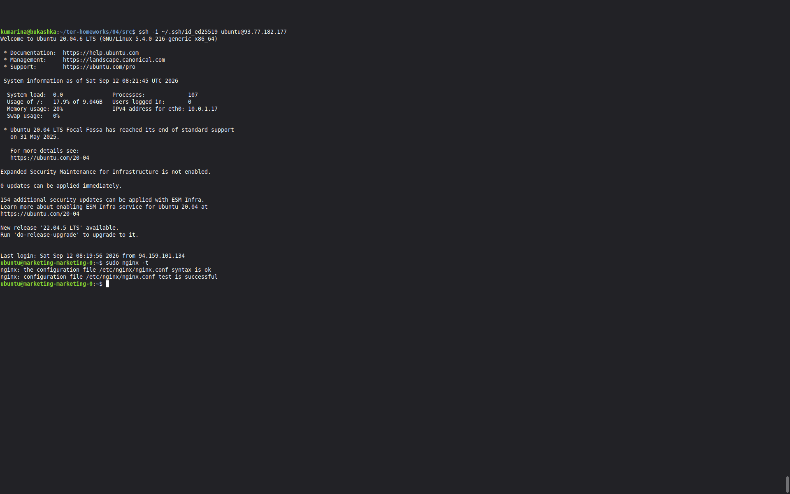
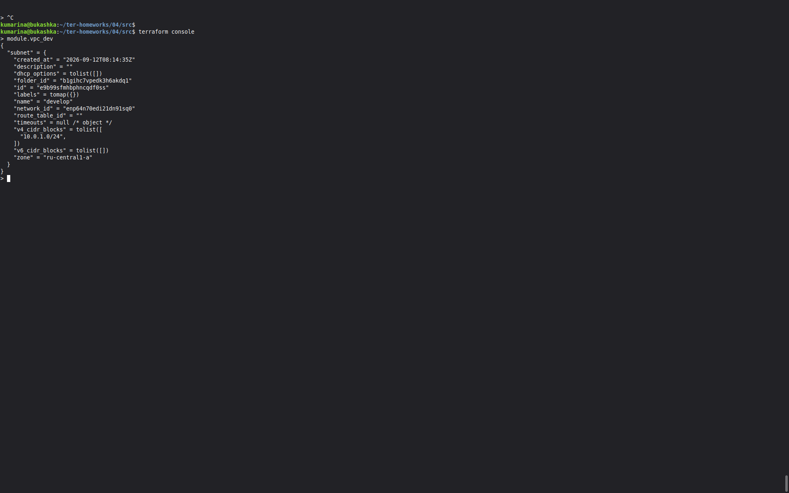
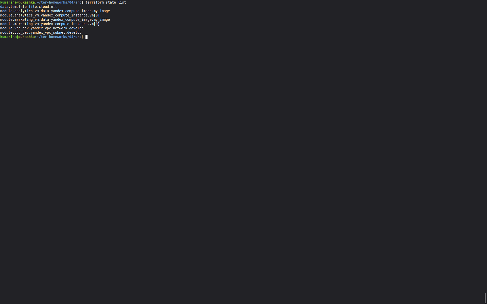
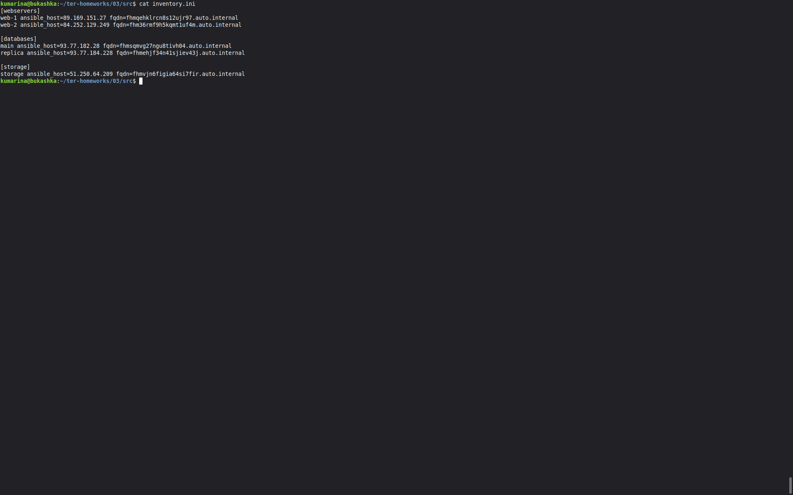
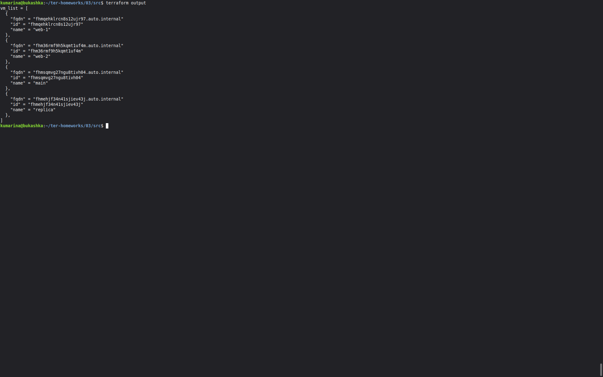
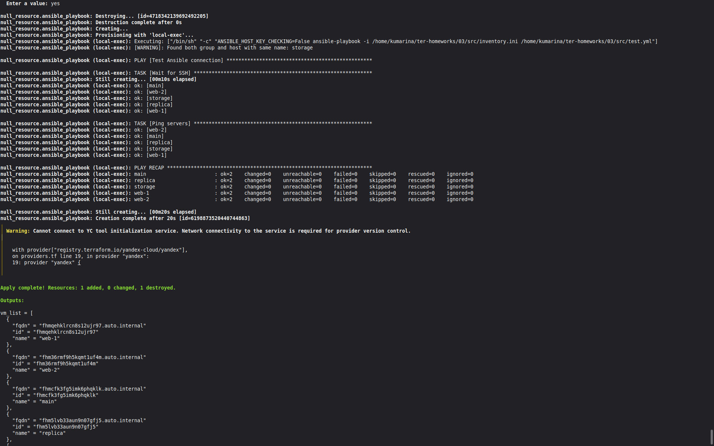

# terraform-03
Домашнее задание к занятию «Управляющие конструкции в коде Terraform»

### Задание 1

### Задание 2
Созданные ВМ

### Задание 3

### Задание 4

### Задание 5

Добавлен Terraform output со списком виртуальных машин.

Для каждой ВМ выводятся:

- `name`
- `id`
- `fqdn`
- 

### Задание 6
Добавлен `null_resource`, который запускает `ansible-playbook`
после создания inventory.

Проверено подключение к виртуальным машинам с помощью Ansible.

