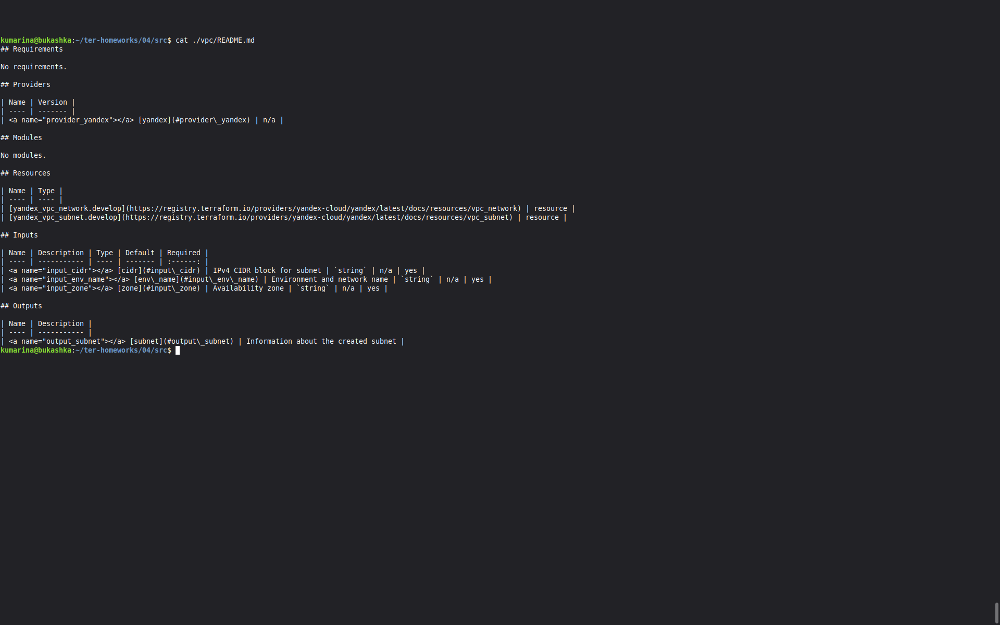
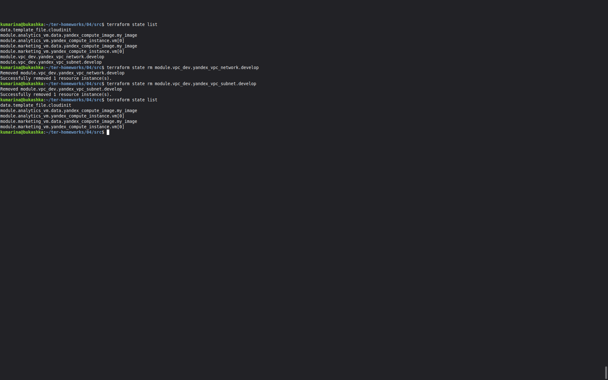
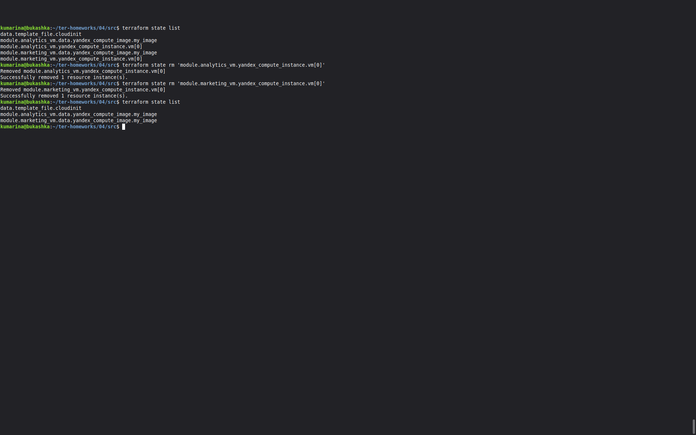
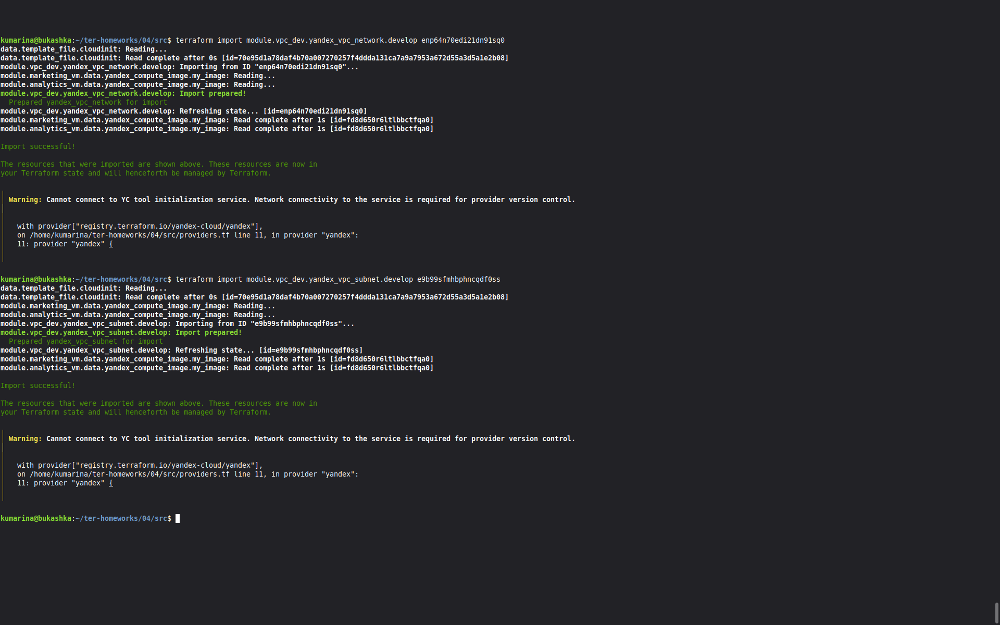
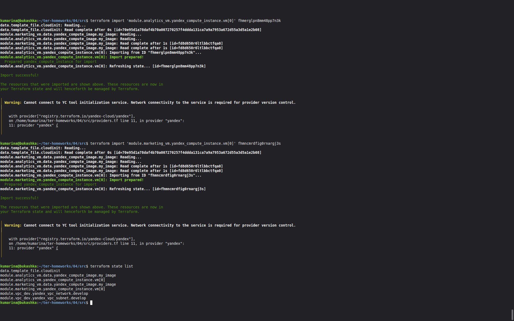
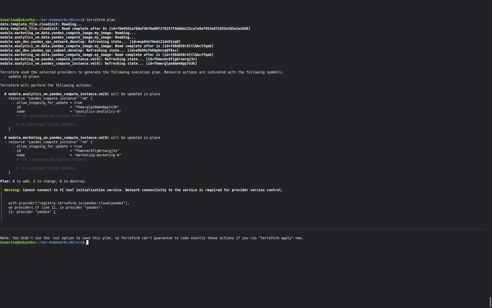

# Домашнее задание по модулю «Продвинутые методы работы с Terraform» Марина Кукушкина 

## Задание 1

Созданы две ВМ в Yandex Cloud с использованием удалённого модуля:

- `marketing`
- `analytics`

Для ВМ:
- добавлены labels `project`;
- включён `preemptible`;
- через `cloud-init` устанавливается nginx;
- SSH-ключ передаётся через `template_file`.

Результат: обе ВМ созданы и работают, nginx успешно установлен.

## Задание 2

Создан локальный модуль `vpc`, который создаёт:

- VPC network;
- subnet.

Модуль принимает `env_name`, `zone`, `cidr` и возвращает информацию о subnet через `output`.

Существующие ресурсы перенесены в state модуля без пересоздания.Информация из terraform console о созданном модуле. 

Документация модуля сгенерирована с помощью terraform-docs.

## Задание 3

Выполнила операции со state:

1. выведен список ресурсов;
2. VPC и ВМ удалены из Terraform state без удаления из Yandex Cloud;
3. все ресурсы импортированы обратно;
4. выполнена проверка terraform plan.

Результат:

Новых ресурсов и удалений инфраструктуры нет.

