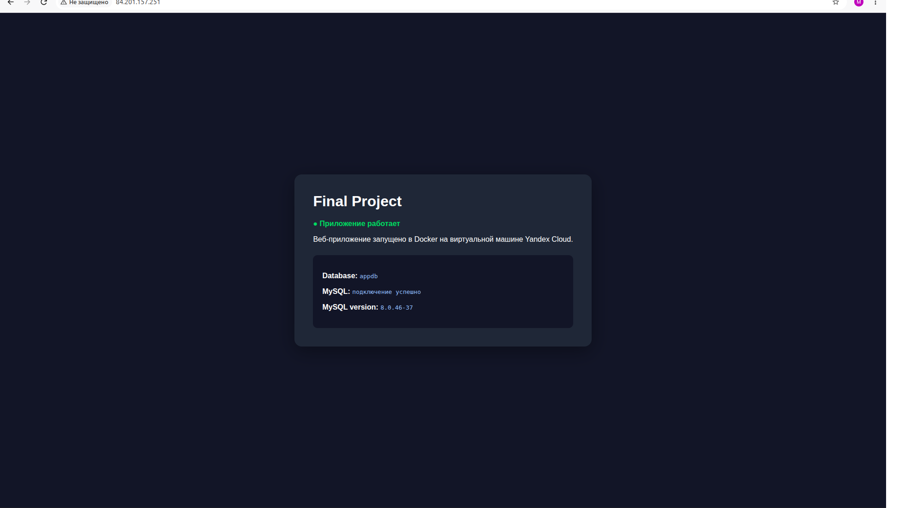
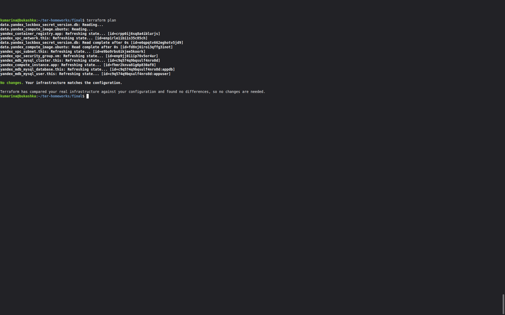
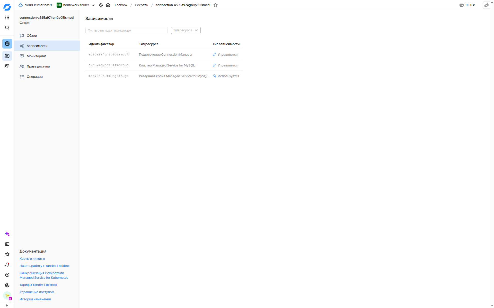

# Final Project — Terraform + Yandex Cloud Марина Кукушкина

В рамках проекта необходимо было произвести автоматизированное развёртывание веб-приложения в Yandex Cloud с помощью Terraform. Мною были использованны:

* Terraform
* Yandex Compute Cloud
* Yandex VPC
* Security Groups
* Container Registry
* Managed MySQL
* Lockbox
* Docker / Docker Compose
* Python / Flask

## Архитектура

```text
Internet
   │
   ▼
Yandex Compute VM
   │
   └── Docker
        └── Flask application
                │
                ▼
          Managed MySQL

Lockbox ──► пароль MySQL

Container Registry ──► Docker image
```

## Инфраструктура

Terraform создаёт:

* VPC и subnet `10.10.0.0/24`
* Security Group с портами `22`, `80`, `443`
* VM Ubuntu 24.04
* Container Registry
* Managed MySQL 8.0
* database `appdb`
* user `appuser`

Docker и Docker Compose устанавливаются автоматически через `cloud-init`.

## Lockbox

Пароль пользователя MySQL хранится в Yandex Lockbox.

Terraform получает его через:

```hcl
data "yandex_lockbox_secret_version" "db" {
  secret_id  = "<LOCKBOX_SECRET_ID>"
  version_id = "<LOCKBOX_VERSION_ID>"
}
```

и передаёт MySQL user:

```hcl
password = data.yandex_lockbox_secret_version.db.entries[0].text_value
```

Пароль не хранится в Git.

## Приложение

Flask-приложение запускается в Docker через Gunicorn.

Проверка:

```bash
curl http://localhost/health
```

Результат:

```json
{"status":"ok"}
```

Главная страница отображает состояние приложения и результат подключения к MySQL.


## Docker

Сборка:

```bash
docker build -t cr.yandex/<registry-id>/final-project-app:v3 ./app
```

Публикация:

```bash
docker push cr.yandex/<registry-id>/final-project-app:v3
```

Запуск:

```bash
docker compose up -d
```

## Terraform

Инициализация:

```bash
terraform init
```

Проверка:

```bash
terraform fmt
terraform validate
terraform plan
```

Применение:

```bash
terraform apply
```

Финальная проверка:

```text
No changes. Your infrastructure matches the configuration.
```

## Скриншоты

### 1. Работающее веб-приложение



### 2. Terraform plan



### 3. Docker


### 4. Terraform State List


### 5. Lockbox



### 6. Container Registry


## Безопасность

Секретные данные не хранятся в Git.

В `.gitignore` исключены:

* `terraform.tfvars`
* `.env`
* SSH keys
* IAM credentials

Пароль MySQL хранится в Yandex Lockbox.

